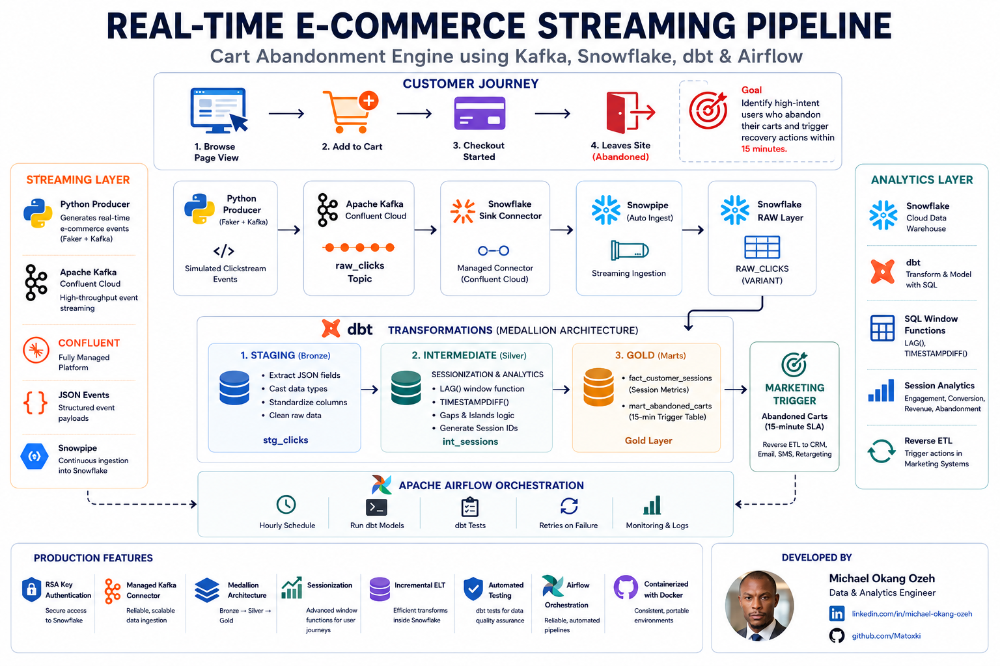
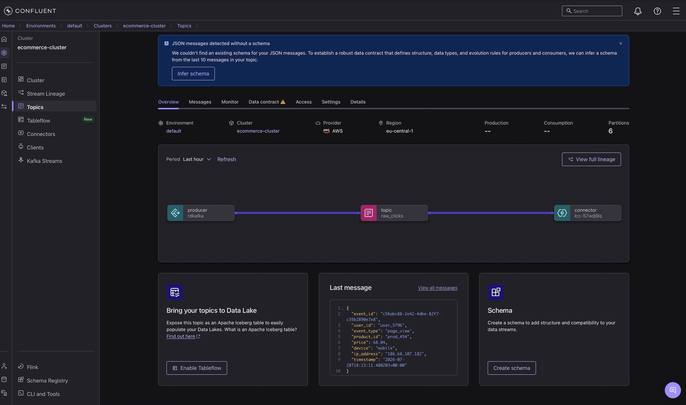
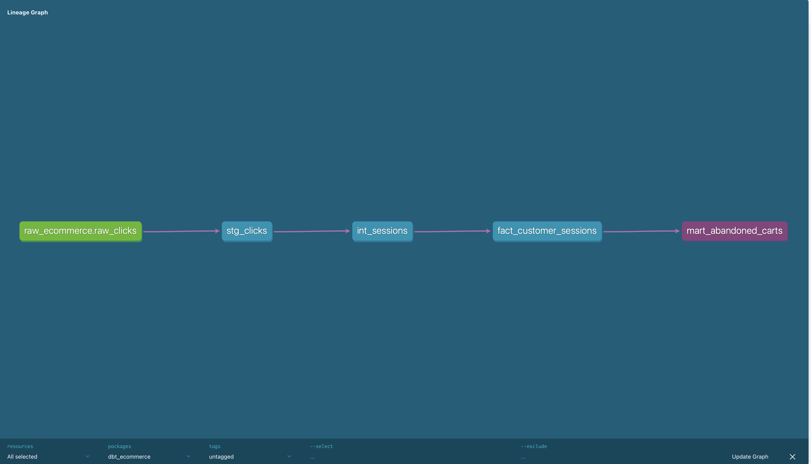
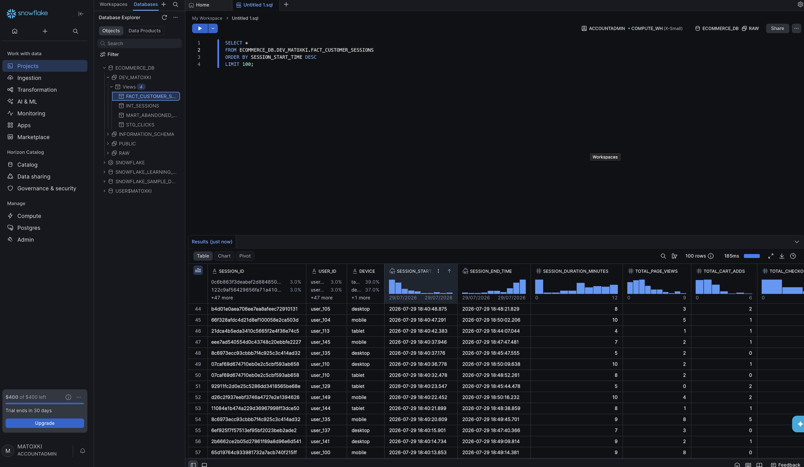
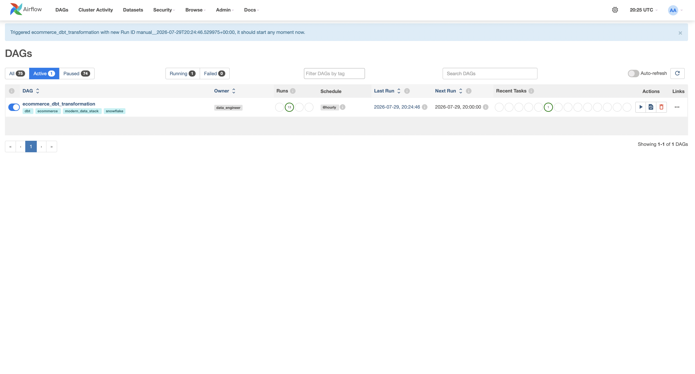
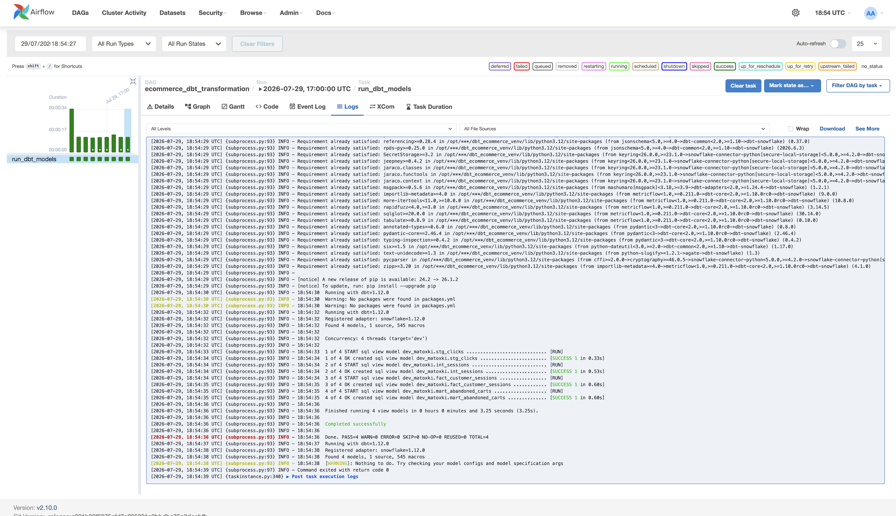

# Real-Time E-Commerce Streaming Pipeline
## Cart Abandonment Engine using Kafka, Snowflake, dbt & Airflow ##

## The Business Problem (The "Why")
In e-commerce, time is revenue. When a customer adds items to their cart but leaves the website without purchasing, sending a follow-up email 24 hours later often yields poor conversion rates. Businesses need to identify abandoned carts the moment a user's session goes cold, enabling immediate, targeted re-engagement while the purchase intent is still high. 

Traditional batch processing architectures are too slow for this. To solve it, I engineered a real-time streaming pipeline that identifies abandoned carts within a defined SLA time window.

## The Solution (The "How")
This project simulates live e-commerce traffic, ingests the data stream continuously, and transforms it into analytics-ready models for marketing teams. 

Building upon the batch-processing concepts I utilized in previous data models, this architecture handles the complexities of continuous data streams, dynamic environment pathing, and real-time state management.

### Architecture & Tech Stack
*   **Data Generation:** Python scripts simulating live user clickstream data (page views, cart adds, checkouts).
*   **Message Broker:** Apache Kafka ingests the high-throughput, continuous stream of events.
*   **Data Warehouse:** Snowflake serves as the highly scalable target for real-time storage.
*   **Transformation:** dbt (Data Build Tool) normalizes the JSON payloads and models the raw events into structured user sessions and a final `MART_ABANDONED_CARTS` view based on strict time-gap thresholds (e.g., 15 minutes of inactivity).
*   **Orchestration:** Dockerized Apache Airflow dynamically manages the execution environment and schedules the dbt transformations.

## The Data Journey: From Stream to Analytics

### 1. The Streaming Layer (Confluent Kafka)
Raw clickstream data is generated continuously and pushed to an Apache Kafka topic.

A managed Confluent Sink Connector then continuously streams this data directly into Snowflake.

### 2. The Transformation Layer (dbt & Snowflake)
Once the raw JSON hits Snowflake, dbt executes a Medallion Architecture (Bronze to Gold), transforming the raw clicks into structured user sessions. 

The `fact_customer_sessions` table aggregates multiple isolated events into coherent sessions, calculating session duration and tracking conversion metrics.

### 3. The Orchestration Layer (Apache Airflow)
The entire dbt pipeline is orchestrated via Apache Airflow running in Docker, ensuring transformations happen on a reliable schedule.

Airflow seamlessly manages the dynamic environment variables and successfully executes the models.

## Engineering Highlights
1.  **Sessionization Logic:** Engineered SQL transformations to group individual, asynchronous Kafka events into unified user sessions based on rolling timestamps.
2.  **Streaming Time Thresholds:** Implemented logic to differentiate active sessions from abandoned sessions by calculating live time differentials (`CURRENT_TIMESTAMP()`) against the most recent event.
3.  **Dynamic Container Paths:** Configured Docker and Airflow to securely inject dynamic environment variables for Snowflake RSA key authentication, seamlessly bridging local development and containerized orchestration.

## Execution
This pipeline is fully containerized. A Python producer generates the continuous mock traffic, while Airflow triggers the dbt DAGs to process the live data into Snowflake in near real-time, resulting in a constantly updating list of actionable cart abandonment leads.